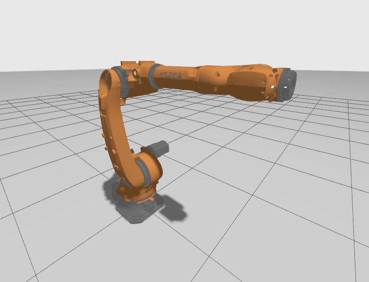
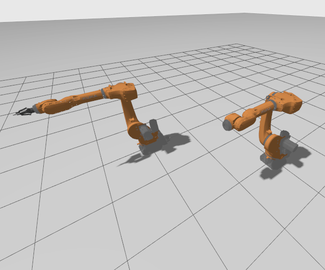
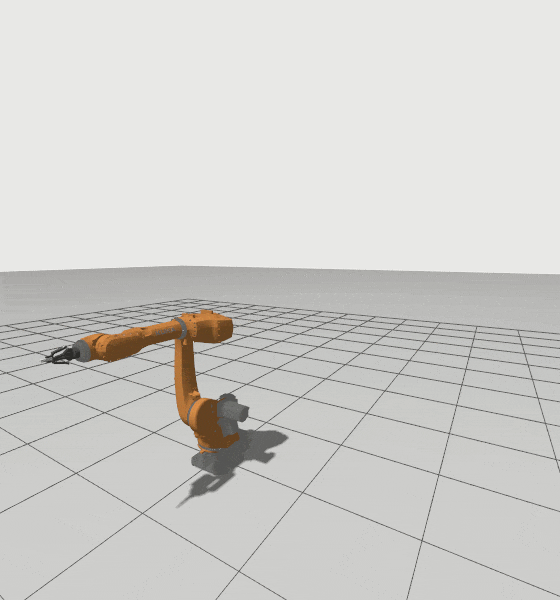

# KUKA-ROS2 Gazebo-Fortress

## Overview

**KUKA-ROS2** is a repository for integrating a KUKA robotic arm with ROS 2 Humble using **Ignition Gazebo** for simulation and MoveIt 2 for motion planning. This project aims to provide a comprehensive setup for simulating and controlling a KUKA robot in a ROS 2 environment.
This repository does not contain Hardare Integration.

## Features

- **KUKA Robot Simulation**: Set up and control a KUKA robotic arm within Ignition Gazebo Fortress.
- **ROS 2 Integration**: Utilizes ROS 2 Humble for communication and control.
- **MoveIt 2 Integration**: Employs MoveIt 2 for advanced motion planning and execution.
- **Robotiq Grippers**: It has Robotiq 2f-85 and 2f-140 integrated to it.
- **Documentation**: Includes configuration files, launch scripts, and example code to get started quickly.

## Prerequisites

Before you begin, ensure you have met the following requirements:

- **ROS 2 Humble**: Follow the [official ROS 2 installation guide](https://docs.ros.org/en/humble/Installation.html) to install ROS 2 Humble.
- **MoveIt 2**: Install MoveIt 2 for ROS 2.

## Installation

1. **Clone the Repository**

    ```bash
    git clone --branch ignition-gazebo https://github.com/REZ3LIET/KUKA-ROS2.git
    cd KUKA-ROS2
    ```

2. **Install Dependencies**

    Ensure you have all necessary dependencies installed:

    ```bash
    sudo apt-get update
    sudo apt-get install ros-humble-moveit
    sudo apt-get install ros-humble-gz
    sudo apt-get install ros-humble-ign-ros2-control
    ```

3. **Build the Workspace**

    Navigate to your ROS 2 workspace and build the project:

    ```bash
    cd your_ros2_workspace
    colcon build
    ```

4. **Source the Workspace**

    ```bash
    source install/setup.bash
    ```

## Usage

1. Launch Kuka

    

    To launch the KUKA robot simulation, use the following commands:
    ```bash
    ros2 launch kuka_gazebo kuka_bringup.launch.py \
        'ign_gz:=True' \
        'use_sime_time:=True' \
        'robot_name:=kuka_arm' \
        'namespace:=""' \
        'gripper_name:=""' \
        'position_x:=0.0' \
        'position_y:=0.0' \
        'orientation_yaw:=0.0'
    ```
    **Launch Parameter Definitions**:
    - ign_gz (Optional): To launch Gazebo [default: 'True']
    - use_sime_time (Optional): Use simulator time [default: 'True']
    - robot_name (Optional): Name of the robot [default: 'kuka_arm']
    - namespace (Optional): Namespace for the robot [default: '']
    - gripper_name (Optional): Name of gripper to use [default: ''] Options=("", "robotiq_2f_85", "robotiq_2f_140")
    - position_x (Optional): X position to spawn the robot [default: '0.0']
    - position_y (Optional): Y position to spawn the robot [default: '0.0']
    - orientation_yaw (Optional): Yaw angle to spawn robot [default: '0.0']

2. Launch Multiple Kuka

    

    To launch multiple KUKA robots simulation, firstly modify `robot_list` in [multi_kuka_bringup.launch.py](./kuka_gazebo/launch/multi_kuka_bringup.launch.py) and then launch the file using:

    ```bash
    ros2 launch kuka_gazebo multi_kuka_bringup.launch.py
    ```

3. Control Kuka (Python)

    

    To control the robot, Action server has been set up as `/Move`. To send the commands to the robot refer and/or execute [action_helper.py:main](./kuka_control/control_scripts/scripts/action_helper.py)

    ```bash
    cd kuka_control/control_scripts/scripts
    python3 action_helper.py
    ```

## Changelog

All changes to this project will be documented in the [CHANGELOG.md](CHANGELOG.md).
See the changelog for detailed information about the project's history, including new features, bug fixes, and updates.

## License
This project is licensed under the Apache 2.0 License. See the [LICENSE](./LICENSE) file for details.


## Acknowledgements
- The **URDF model** for the KUKA robot was taken from the [kuka_robot_descriptions repository](https://github.com/kroshu/kuka_robot_descriptions). Specifically, it is located in `kuka_robot_descriptions/kuka_iontec_support/urdf/`. 
- The **descriptions of Robotiq grippers** were taken from the [PickNik Robotics' GitHub repository](https://github.com/PickNikRobotics/ros2_robotiq_gripper/tree/main).
- The **functionality to control the robot via Actions** was borrowed from the following repositories:
  - [ros2_RobotSimulation](https://github.com/IFRA-Cranfield/ros2_RobotSimulation/tree/humble) by IFRA-Cranfield.
  - [ros2_SimRealRobotControl](https://github.com/IFRA-Cranfield/ros2_SimRealRobotControl) by IFRA-Cranfield.
- [ROS 2](https://index.ros.org/doc/ros2/) for the framework and tools supporting robot development.
- [Gazebo](https://gazebosim.org/docs/latest/getstarted/) for the simulation environment.
- [MoveIt 2](https://moveit.picknik.ai/humble/index.html) for motion planning and control.


Thank you to the original authors for providing these valuable resources.
