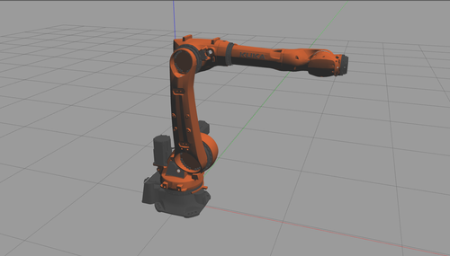
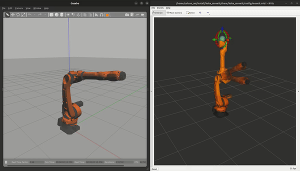
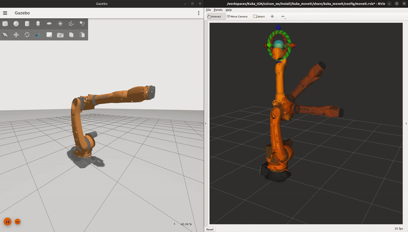

# KUKA-ROS2

## Overview

**KUKA-ROS2** is a repository for integrating a KUKA robotic arm with ROS 2 Humble using **Classic Gazebo** and **Gazebo Fortress** for simulation and MoveIt 2 for motion planning. This project aims to provide a comprehensive setup for simulating and controlling a KUKA robot in a ROS 2 environment.
This repository does not contain Hardare Integration.

## Features

- **KUKA Robot Simulation**: Set up and control a KUKA robotic arm within Classic Gazebo.
- **ROS 2 Integration**: Utilizes ROS 2 Humble for communication and control.
- **MoveIt 2 Integration**: Employs MoveIt 2 for advanced motion planning and execution.
- **Documentation**: Includes configuration files, launch scripts, and example code to get started quickly.

## Prerequisites

Before you begin, ensure you have met the following requirements:

- **ROS 2 Humble**: Follow the [official ROS 2 installation guide](https://docs.ros.org/en/humble/Installation.html) to install ROS 2 Humble.
- **MoveIt 2**: Install MoveIt 2 for ROS 2.

## Installation

- For Classic Gazebo refer: [Kuka-ROS2 Classic-Gazebo branch](https://github.com/REZ3LIET/KUKA-ROS2/tree/classic-gazebo?tab=readme-ov-file#installation)
- For Gazebo Fortress refer: [Kuka-ROS2 Gazebo-Fortress branch](https://github.com/REZ3LIET/KUKA-ROS2/tree/ignition-gazebo?tab=readme-ov-file#installation)

## Usage
### Gazebo 

Classic Gazebo             |  Gazebo Fortress
:-------------------------:|:-------------------------:
  |  

To launch the KUKA robot simulation, use the following commands:
```bash
ros2 launch kuka_gazebo gazebo.launch.py
```

### MoveIt 2  

Classic Gazebo             |  Gazebo Fortress
:-------------------------:|:-------------------------:
  |  

To launch the KUKA moveit in RVIZ, use the following commands:
```bash
ros2 launch kuka_gazebo moveit.launch.launch.py
```

## License
This project is licensed under the Apache 2.0 License. See the [LICENSE](./LICENSE) file for details.


## Acknowledgements
- The URDF model for the KUKA robot was borrowed from [kuka_robot_descriptions](https://github.com/kroshu/kuka_robot_descriptions). Specifically, it is located in `kuka_robot_descriptions/kuka_iontec_support/urdf/`. Thank you to the original authors for providing this valuable resource.
- [ROS 2](https://index.ros.org/doc/ros2/)
- [Gazebo](http://gazebosim.org/)
- [MoveIt 2](https://moveit.picknik.ai/humble/index.html)
